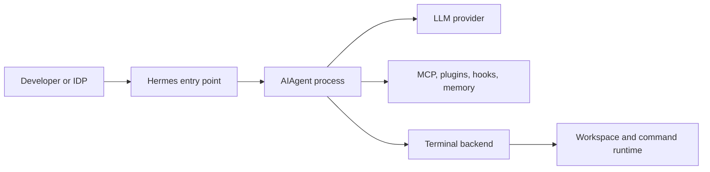

# Capabilities and Architecture

Status: documented unless marked otherwise. Baseline: Hermes Agent v0.20.5.

## Execution Model

Hermes has a shared `AIAgent` loop behind several entry points:

- interactive CLI and TUI;
- a long-running messaging gateway;
- an OpenAI-compatible HTTP API and Hermes-specific runs API;
- ACP over stdio for editor hosts;
- batch/trajectory runners and a Python library.

The loop resolves an LLM provider, assembles the prompt, dispatches tools, persists sessions in SQLite/FTS5, and repeats until a final answer. This is a stateful agent runtime, not just an LLM proxy.

## Capability Inventory

| Surface | What it provides | IDP relevance |
| --- | --- | --- |
| Tool registry | Terminal, files, web, browser, media, memory, delegation, cron, integrations | Broad capability, but requires aggressive least-privilege selection |
| Toolsets | Per-platform groups plus a global disabled-toolset list | Coarse capability packaging; verify effective tools through `/v1/toolsets` |
| Terminal backends | Local, Docker, SSH, Singularity, Modal, Daytona, Vercel Sandbox | Separates shell/file execution from the agent host |
| API server | Chat Completions, Responses, Runs, Jobs, Sessions, capability discovery | Best control-plane integration candidate |
| MCP client | Stdio and HTTP servers, OAuth/mTLS, include/exclude tool filters | Best way to expose narrow IDP operations |
| MCP server | Stdio bridge for Hermes messaging operations | Useful for agent-to-agent messaging, not a general HTTP service |
| ACP | Editor chat, diffs, terminal, approvals, streaming | Strong local developer experience; host behavior controls approval UX |
| Skills | Procedural instructions and supporting code | Useful for golden paths; installed code is a supply-chain surface |
| Plugins | Tools, commands, middleware, hooks, providers, adapters | Deep integration at the cost of full in-process trust |
| Hooks/webhooks | Observe, transform, block, approve, or emit lifecycle events | Audit and policy integration; behavior varies by hook type |
| Memory/sessions | Local persistent memory, searchable history, profile isolation | Requires retention, privacy, and tenant-boundary decisions |
| Cron/background work | Scheduled agent jobs and asynchronous sessions | Useful automation; unattended controls must fail closed |

## Important Boundaries

The agent process and the terminal backend are different runtime layers:

Selecting a remote or container terminal backend moves terminal and file activity. Current runtime documentation and source also describe remote `execute_code` paths, while the security policy warns that code execution is not generally contained by terminal-backend isolation. Treat the effective route as version-specific and test it. A terminal backend does not by itself confine every in-process extension; whole-process isolation wraps the `AIAgent` process and its children.

## API Characteristics

The API server requires bearer authentication and defaults to loopback. Useful integration endpoints include:

- `GET /v1/capabilities` for feature discovery;
- `POST /v1/runs` plus status, SSE events, stop, and approval endpoints;
- `/api/sessions/*` for durable session workflows;
- `GET /v1/skills` and `GET /v1/toolsets` for deterministic discovery;
- `GET /health` for liveness and authenticated `/health/detailed` for readiness.

Chat Completions is stateless from the client's perspective. Responses, Runs, and Sessions can preserve server-side context. The API executes tool calls server-side; clients do not receive pending calls to execute themselves.

## Known Limitations

- The gateway is described as a single-tenant personal agent.
- All authorized callers inside one adapter are equally trusted for tool capability; slash-command admin tiers do not restrict normal-chat tool use.
- Profiles separate config, memory, sessions, and credentials, but are not a substitute for process/container separation when stronger tenancy is required.
- The API supports bearer keys, not native enterprise end-user identity, scoped tokens, or per-tool OAuth authorization.
- Plugin, hook, and skill APIs are broad and fast-moving. Prefer stable network boundaries before in-process customization.

## Sources

See [the source register](../research/sources.md), especially S01, S04, S06, S07, and S08.