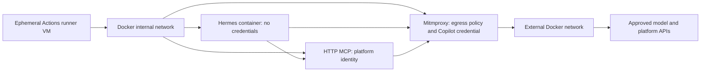

# GitHub Actions Runtime

Status: GitHub behavior is documented; the Hermes deployment design is inferred and must be tested. Baseline: GitHub.com and Hermes Agent v0.20.5, reviewed 2026-08-22.

## Verdict

GitHub Actions is a good runtime for bounded, repository-scoped Hermes tasks such as review, diagnosis, change planning, and patch generation. It is a poor replacement for the persistent messaging gateway. The secure pattern is one fresh agent container per job, no secrets in that container, and deterministic capabilities in separately authenticated sidecars.

## Why Not `jobs.<job>.container` Alone?

Actions job and service containers join a user-defined Docker bridge. They can address each other by service label, but they also retain outbound connectivity. GitHub explicitly does not support `--network` in job-container options.

This configuration is useful packaging, but not enforceable egress control:

```yaml
container:
  image: example/hermes
  env:
    HTTPS_PROXY: http://proxy:3128
services:
  proxy:
    image: example/allowlist-proxy
```

An adversarial process can remove the proxy variables and connect directly. A proxy becomes a boundary only when routing or network policy makes it the sole path out.

## Implemented Topology

Run the workflow steps on `ubuntu-latest` and let those trusted steps create the containers:



  The internal Docker network has no default external route. Only mitmproxy is dual-homed. Hermes uses a custom provider pointed at `https://api.githubcopilot.com` with a fixed non-secret bearer sentinel. Mitmproxy terminates that proxied TLS connection using its per-job CA, verifies source, host, path, model, and sentinel, then replaces the sentinel with the Copilot token from its own secret mount. MCP is separately allowed to reach fixed GitHub repository paths with the job token.

  Mitmproxy is used in regular mode, not transparent mode. The launcher copies only the generated public CA certificate into Hermes and MCP. This avoids privileged host routing while allowing application-layer authorization replacement. It does mean mitmproxy can inspect model prompts and responses, so the proxy image/addon are part of the trusted computing base and flow archives must remain disabled.

## Responsibility Split

| Component | Contains | Must not contain |
| --- | --- | --- |
| Trusted workflow | Container lifecycle, checkout, secret staging, cleanup, artifact selection | Unquoted event data interpolated into shell scripts |
| Hermes | Prompt, source tree, agent loop, selected tools | `GITHUB_TOKEN`, provider key, Docker socket, cloud credentials |
| Mitmproxy gateway | Copilot credential, CA private key, source/host/path/model policy | Repository/platform credential, persisted flow archives |
| MCP service | Deterministic schemas, authorization, GitHub App/OIDC token, audit context | General shell, arbitrary URL fetch, credential-returning tools |
| Proxy | Source/destination allowlist and access logs | Application credentials or business authorization decisions |

The MCP service should expose intent-level operations such as `get_check_run`, `read_catalog_entity`, `propose_pull_request`, or `request_environment`. It should validate repository, ref, path, resource, and payload fields; re-authorize every call; enforce idempotency; and never return its credential.

## Read and Write Separation

Use two workflows or jobs with different trust:

### Analysis workflow

- Trigger on `workflow_dispatch`, `pull_request`, or an approved reusable-workflow caller.
- Set `permissions: contents: read` and everything else to `none` implicitly.
- Never use `pull_request_target` to check out and process untrusted PR code.
- Mount the checkout read-only into Hermes.
- Give the MCP sidecar only read APIs.
- Publish a bounded, secret-scanned report or patch artifact.

Fork pull requests should be treated as fully adversarial. They receive no privileged sidecar credentials and cannot mutate repository state.

### Mutation workflow

- Trigger explicitly after a human or policy decision, not from agent-produced shell output.
- Use a protected GitHub environment with required reviewers.
- Grant only the required job permissions, such as `contents: write` or `pull-requests: write`.
- Give the mutation MCP service narrow GitHub App or job-token permissions.
- Revalidate the target SHA, repository, policy decision, and artifact digest before applying anything.
- Prefer creating a branch and pull request over direct pushes.

Do not pass artifacts from an unprivileged workflow into a privileged `workflow_run` job without treating every byte as hostile and binding it to the reviewed SHA.

## Authentication Outside Hermes

Three practical choices belong in the MCP or LLM sidecar:

1. **`GITHUB_TOKEN`:** Job-scoped and convenient. Set workflow permissions to the minimum and mount the token file only into the MCP container.
2. **GitHub App installation token:** Better for narrowly defined cross-repository operations. Mint it in the trusted sidecar and keep the private key outside Hermes.
3. **GitHub Actions OIDC:** Preferred for cloud, Vault, artifact, or IDP access. Grant `id-token: write`, validate immutable repository/workflow/environment claims at the relying party, and exchange for a short-lived token inside the sidecar.

`id-token: write` allows requesting an identity token; it does not itself grant cloud access. The relying party's trust policy is the authorization boundary. Do not forward the Actions OIDC request token or resulting cloud token to Hermes.

For the Copilot smoke test, a Copilot-capable OAuth `gho_*` token is staged only into mitmproxy. The ordinary Actions token does not carry the user's Copilot subscription entitlement and remains in MCP. Although GitHub documents fine-grained PATs with `Copilot Requests` for Copilot CLI, the direct Copilot endpoint used here rejected the tested PAT; the workflow therefore treats OAuth/app-user tokens as the supported direct-API credential set.

## Hermes Configuration

Use unattended-safe settings:

- `approvals.single_query_mode: deny`;
- no YOLO mode;
- bounded `agent.max_turns` and `agent.run_budget_seconds` below the job timeout;
- tool-loop hard stops;
- no memory or skill writes unless the job explicitly preserves reviewed state;
- no web/browser/messaging toolsets for source tasks;
- no lazy dependency installation;
- a read-only source mount for analysis;
- an HTTP MCP include list containing only the intended actions.

The reference uses a native configured HTTP MCP endpoint on the internal Docker network while leaving `security.allow_private_urls` disabled. Current Hermes validation permits configured HTTP(S) MCP URLs; the private-URL switch documented for web, browser, vision, and media fetches is not required for this path. Re-test this behavior when pinning a new Hermes release.

Because the entire Hermes process is already disposable, use Hermes' local terminal backend inside its container rather than mounting the runner's Docker socket to create another terminal sandbox. If stronger syscall or filesystem isolation is required, use a hardened agent image, gVisor-capable self-hosted runner, OpenShell, or another outer sandbox.

## GitHub-Specific Threats

- **Workflow injection:** Put event values in environment variables or files; never splice PR titles, branch names, issue bodies, or prompts into generated shell source.
- **Untrusted checkout:** Avoid privileged `pull_request_target` plus checkout. Treat `workflow_run` artifacts as hostile.
- **Action supply chain:** Pin every third-party action to a full commit SHA and protect workflow changes with CODEOWNERS.
- **Token exposure:** Any action in the job can access `github.token`; minimize permissions and minimize third-party actions before credential staging.
- **Docker control plane:** Runner-level workflow steps can inspect containers and secrets. Keep orchestration small, reviewed, and before/after the untrusted agent container; never expose the daemon socket to Hermes.
- **Logs/artifacts:** Redaction is exact-match and not guaranteed after transformations. Secret-scan outputs and publish only explicit files.
- **Denial of service/cost:** Apply workflow concurrency, job timeout, model budget, sidecar rate limits, and artifact size limits.

## Platform Limits

- Standard GitHub-hosted jobs have a six-hour execution limit.
- Hosted VMs are fresh for each job, but caches and uploaded artifacts are durable surfaces and must not contain Hermes state or credentials accidentally.
- Standard runners have changing preinstalled software. Pin container images by digest for a decision-grade evaluation.
- Larger runners can use custom VM images and private networking; these are stronger options when organization-level egress controls are required.
- Self-hosted runners are persistent-risk infrastructure unless implemented as clean, just-in-time machines. Do not use long-lived shared runners for untrusted pull requests.

## Required Tests

1. From Hermes, HTTPS to an arbitrary public host fails without consulting proxy configuration.
2. From Hermes, the internal MCP endpoint and Copilot through mitmproxy succeed.
3. Mitmproxy rejects a wrong source, host, path, model, or sentinel before forwarding.
4. From the MCP sidecar, only approved GitHub/IDP domains succeed.
5. Hermes cannot read sidecar secret files, Docker metadata, runner environment variables, or the Docker socket.
6. A forged user/repository/ref argument is denied by MCP authorization.
7. Cancelling or timing out the job removes containers, networks, and staged secret files.
8. Published artifacts contain only allowlisted files and pass secret scanning.

## Sources

See [the source register](../research/sources.md), especially S13 through S20, plus Hermes sources S02, S03, S05, and S08.