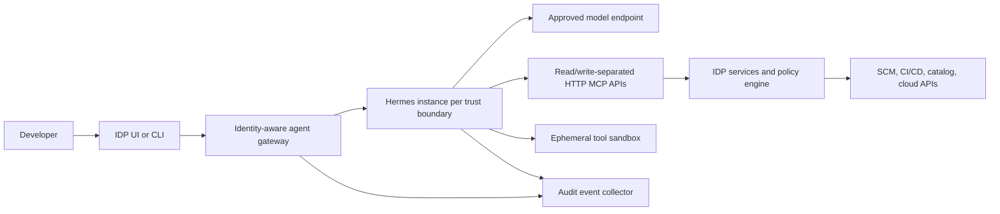

# Internal Developer Platform Feasibility

Status: architecture assessment based on documented Hermes behavior. Baseline: Hermes Agent v0.20.5.

## Verdict

Hermes is feasible as an IDP-adjacent specialist agent, not as the IDP's source of truth or authorization system. A pilot should be single-tenant or strongly partitioned, use narrow platform APIs, and keep policy enforcement outside the agent process.

## Good Initial Use Cases

- explain service ownership, templates, scorecards, and deployment state;
- prepare a change plan or pull request in an isolated worktree;
- investigate CI failures using read-only logs and metadata;
- scaffold a service through an existing golden-path API;
- request a deployment or environment through an approval-backed IDP workflow;
- summarize incidents without direct production mutation rights.

Avoid broad production administration, shared “ops bot” credentials, direct secret access, or unrestricted cluster/cloud CLIs in the first pilot.

## Integration Options

| Option | Recommendation | Reason |
| --- | --- | --- |
| Runs API behind an IDP gateway | Preferred control path | Supports submit, events, status, cancellation, approvals, sessions, and capability discovery |
| GitHub Actions one-shot runner | Preferred batch path | Native repository event context, ephemeral VM, reviewable workflow, bounded lifetime |
| Narrow remote HTTP MCP servers | Preferred tool path | Keeps business logic and authorization in platform-owned services; tools can be allowlisted |
| ACP | Preferred workstation/editor path | Native diffs, terminal activity, approvals, and streamed output over stdio |
| Skills | Good for reviewed golden-path guidance | Low implementation cost, but instructions are not enforcement and supporting code must be reviewed |
| Outbound signed webhooks | Good supplemental observability | Easy event integration, but delivery is bounded/best-effort |
| Plugin/hooks | Use only for missing lifecycle policy or telemetry | Powerful in-process code with access to sensitive prompts, results, credentials, and host objects |
| Direct database/state access | Avoid | Couples the platform to private storage and bypasses supported APIs |

## Reference Architecture

The IDP gateway should authenticate the human, authorize the requested agent profile, mint a task identity, enforce quotas, and map a request to an isolated Hermes instance/session. The MCP service must re-authorize every operation based on that identity; it must not trust model-supplied user IDs.

For repository-scoped asynchronous work, the gateway may dispatch a reusable GitHub Actions workflow instead of maintaining a resident Hermes service. The workflow should start a fresh Hermes container for one task, expose deterministic platform actions through an HTTP MCP sidecar, and return a report or proposed patch as an artifact. A separate environment-protected workflow should perform approved mutations.

## Required Design Decisions

### Tenancy

Hermes says callers authorized within one adapter are equally trusted. Use separate processes/containers for security boundaries. Profiles are useful for configuration isolation, but process isolation is safer for teams, customers, or materially different credentials.

### Authorization

The native API key is instance-wide and tool-powerful. Put it behind the IDP gateway, do not issue it to browsers, and do not treat CORS as authorization. Keep mutating tools separate from read-only tools and require policy-engine approval for high-impact actions.

### Identity and credentials

Prefer short-lived workload identity exchanged server-to-server by a platform MCP service. Avoid forwarding `GITHUB_TOKEN`, cloud credentials, kubeconfig, or human OAuth tokens into a general shell sandbox. A credential visible to a tool runtime should be assumed compromised.

In Actions, stage `GITHUB_TOKEN`, GitHub App credentials, or OIDC token-request capability only into the trusted MCP/auth sidecar. The Hermes container should receive no repository token. Use read-only workflow permissions by default and an environment with required reviewers before a mutation job receives write permissions.

### State and retention

Define retention for prompts, tool outputs, sessions, memories, spillover files, checkpoints, and logs. Disable or scope cross-session memory until privacy and deletion behavior are accepted. Back up and encrypt persistent state.

### Observability

Record request principal, profile, session/turn/run IDs, model/provider, policy decision, tool name, result status, latency, token/cost data, and artifact references. Redact before export. Use Hermes events as evidence, but keep the authoritative audit ledger external.

### Reliability

Use idempotency keys, bounded retries, cancellation, run budgets, and external reconciliation. Hermes supports at-least-once messaging delivery and brief run-state retention; the IDP still owns durable workflow state.

## Pilot Acceptance Criteria

- Every agent request resolves to an authenticated human and workload identity.
- A compromised prompt cannot reach an unapproved network destination or filesystem path.
- A user cannot read another user's sessions, workspace, memory, or credentials.
- Mutating platform operations are independently authorized and audited by the IDP.
- The agent can be stopped, timed out, and cleaned up without orphaned infrastructure.
- Effective tools, skills, plugins, model route, and runtime policy are discoverable for each run.
- State backup, deletion, upgrade, and incident-response procedures are exercised.

## Decision

Proceed to a constrained proof of concept if the target use case can operate through read-only or approval-backed platform APIs. Do not proceed with a shared production agent that has direct shell access to broad internal networks or standing administrative credentials.

## Sources

See [the source register](../research/sources.md), especially S02, S06, S07, S08, S09, and S12.